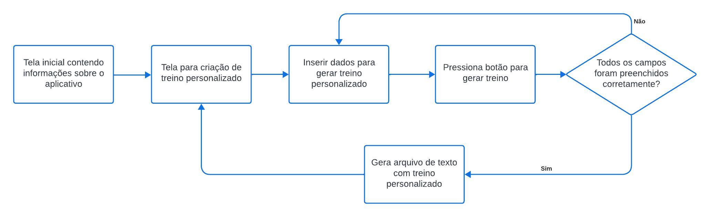

# EB Run

## Conceito

O projeto a ser desenvolvido terá como objetivo ajudar o usuário a melhorar seu desempenho  no Teste de Aptidão Física (TAF), criando uma rotina de treinos com base no resultado do seu último TAF e no tempo que o militar terá para treinar para o próximo teste.

## Função

A aplicação irá montar uma rotina de treinos de corrida com base no resultado do último TAF e no tempo que o usuário terá para se preparar para a próxima prova. 

## Motivação

O TAF é um aspecto muito importante na vida de todo militar, pois influencia diretamente em sua classificação e consequentemente na sua carreira. Dessa forma, é importante que se tenha um bom desempenho no teste. Por esse motivo, é importante que se mantenha uma rotina de treinos com foco e disciplina. Para isso, é necessário ter organização e clareza nos objetivos, fatores esses que serão os pontos centrais do projeto.

## Diagrama de Classes 

## Fluxograma 

## Tutorial

O aplicativo utiliza a estrutura de desenvolvimento de interface gráfica de usuário WPF (Windows Presentation Foundation) da Microsoft e é desenvolvido com a linguagem de programação C#. Para executar o aplicativo, certifique-se inicialmente de possuir instalada a versão 4.7.2 ou superior do .NET Framework em seu desktop. Em seguida, faça o download manual do arquivo executável (.exe) no formato ZIP, extraia os arquivos e execute o aplicativo.

## Esboço do aplicativo 

A tela inicial do nosso aplicativo de treino para corrida apresenta um design intuitivo e funcional com duas opções principais no menu de tarefas para optimizar a experiência do usuário.
1. Início:
   O ponto de partida para os corredores, permitindo um acesso rápido à uma descrição da proposta do aplicativo e do que o usuário pode esperar com seu uso.

   

3. Monte seu treino:
   Uma funcionalidade personalizada que capacita os usuários a criar treinos específicos de acordo com seus objetivos e preferências baseando-se no seu último resultado no TAF, a fim de alcançar melhores rendimentos nos próximos testes físicos. Ao gerar o treino, um arquivo .txt é salvo na mesma pasta do repositório do aplicativo. 

O layout simples e as opções claramente categorizadas tornam a navegação intuitiva, proporcionando aos usuários uma experiência fluida desde o primeiro contato com o aplicativo. 
